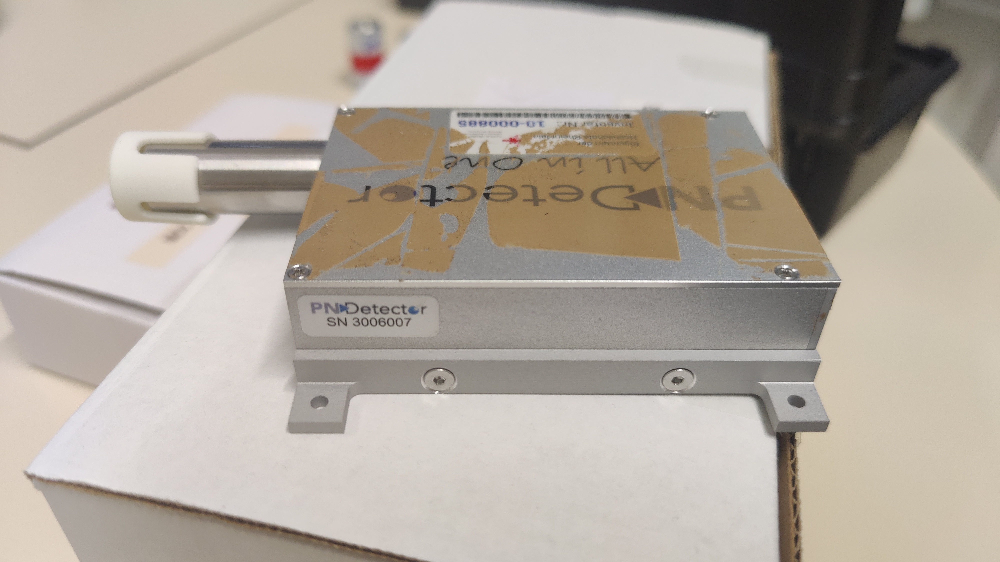
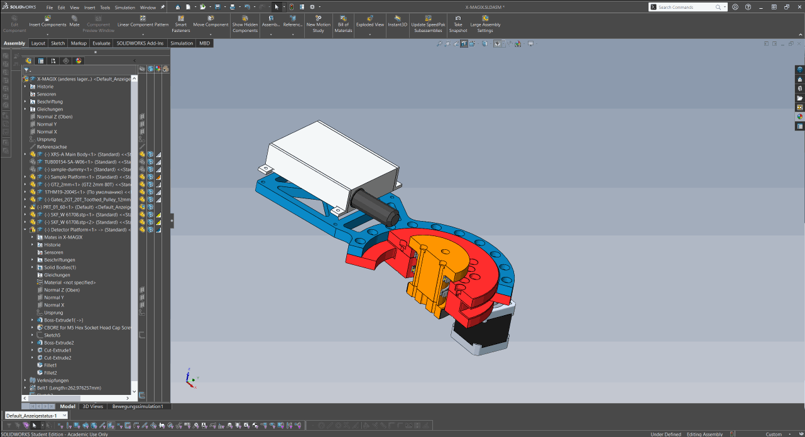
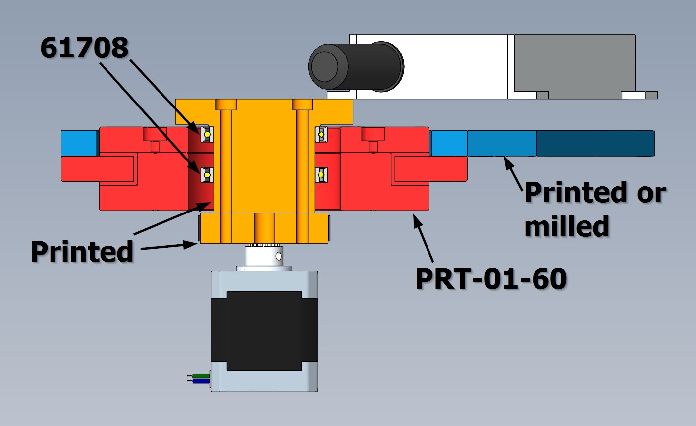

<!-- LTeX: language=en-EN -->

- [1. 🔩 Hardware At Hand](#1--hardware-at-hand)
  - [1.1. Source](#11-source)
    - [1.1.1. 📜 Documentation](#111--documentation)
  - [1.2. Detector](#12-detector)
    - [1.2.1. 📜 Documentation](#121--documentation)
- [2. 👀 Stuff to do](#2--stuff-to-do)
- [3. 💸 Shopping List](#3--shopping-list)
- [4. Drafting Area](#4-drafting-area)

# 1. 🔩 Hardware At Hand

## 1.1. Source

**Magpro TUB00154-SA-W06:**

* XRF and X-ray imaging
* 60kV (70 keV?)
* Spot size (.25 x 1.07)mm
* ~17.6e3cps @ 16.4uA (40kV)

**SA** => SPI (**S**) and Analog (**A**) control type

**W06** => Tungsten target (transmition lines provided by [NIST](https://physics.nist.gov/cgi-bin/XrayTrans/search.pl?element=W&lower=&upper=&units=eV))

Made by [Moxtek](https://moxtek.com/) and distributed (EU) by [Quantum Design](https://qd-europe.com/de/de/)

### 1.1.1. 📜 Documentation

Available documentation can be found inside this repo:

* [DATASHEET_TUB00154-SA-W06.pdf](docs/OnPaper/DATASHEET_TUB00154-SA-W06/DATASHEET_TUB00154-SA-W06.pdf)
* [MANUAL_TUB-MAN-1007.pdf](docs/OnPaper/MANUAL_TUB-MAN-1007/MANUAL_TUB-MAN-1007.pdf)
* [TUB-DATA-1013-MAGPRO.pdf](docs/Online/TUB-DATA-1013-MAGPRO.pdf)

and on my OneDrive:

* [🔒 Moxtek MagPro 70kV  XRF Source (TUB00154-XX-XXX  TUB00155-XX-XXX) Product Specification (TUB-SPEC-1033) Rev H.pdf](https://hsrheinmain-my.sharepoint.com/:b:/g/personal/lmy9f42u92_hsrheinmain_onmicrosoft_com/EV1KUsbPE4NGpiN00cES0QcBQOVuTafLMZQphgjChVBe-A?email=daniel.muenstermann%40hs-rm.de&e=YY6j7k)
* [🔒 TUB00154-XX-XXX Mechanical Drawing.pdf](https://hsrheinmain-my.sharepoint.com/:b:/g/personal/lmy9f42u92_hsrheinmain_onmicrosoft_com/Eb5gZbNKkz1OtNJbWsKaR_sB0skO_YVYC2-HvIApNUwNWA?email=daniel.muenstermann%40hs-rm.de&e=mrExvE)

## 1.2. Detector

SDD Detector made by *PN Detector*: [XRS-A (All-in-One)](https://pndetector.de/products-applications/the-xrf-spectrometer-all-in-one/)

### 1.2.1. 📜 Documentation

OneDrive:

* [🔒 User Manual - XRS-A-30-128-200-MLC+GUI 0.1.1 -3006007.pdf](https://hsrheinmain-my.sharepoint.com/:b:/g/personal/lmy9f42u92_hsrheinmain_onmicrosoft_com/EWPr4Hw9F3tDvXxqMdxp95wBGIPgKuyxWKV6rSSlt5RyFA?email=daniel.muenstermann%40hs-rm.de&e=1WMr1p)

# 2. 👀 Stuff to do

In no particular order:

* [x] Text *[Quantum Design](https://qd-europe.com/de/de/)* about
  * [x] Linux-Software available?
  
    >*"No, only Microsoft"*

    * [ ] Make custom software?
  * [x] how to switch analog <=> digital control

    >*"10-pin is programmed for either I2C, SPI or Analog at the factory.  If a customer orders with Analog, they need to run digital through the USB or send back for reprograming and testing."*

  * [x] further documentation

    >*"FYI, 12W can operate down to -5kV setting, but the spec docs currently talk to the settings for 40kV and above.  If the customer wants to operate below 40kV, the voltage is scaled linearly from 0-4.667VDC for 0 to -70kV(but will not run at all at voltages less than -4kV setting), and 0-4VDC for 0 to 1000uA current setting.  Current needs to be limited to not exceed 12W total power, so 1,000uA does not work well above 12kV setting, and they will need to reduce the emission current as they select higher kV to keep power at or below 12W.  -W06 target is really not meant to be run below 40kV, as the W coating is thick enough that it blocks a majority of the flux intensity at kV settings below 30kV.  They can run down as low as 30kV, but stability may be affected in their application below 40kV setting."*

    Additional spec sheet and drawings are made available 👌 but are classified. => Plz check [OneDrive](https://hsrheinmain-my.sharepoint.com/:f:/g/personal/lmy9f42u92_hsrheinmain_onmicrosoft_com/Eu1u_OxAc6tNtfoioA8n_JEBt5x4kzV99mTDH0zqPgQLmQ?email=daniel.muenstermann%40hs-rm.de&e=uNh9up).
  * [x] CAD files => DIY
* [ ] Enclosure options
  * [ ] [Zarges-Boxes](https://www.zarges.com/de/produkte/verpacken-transportieren/kisten)?
  * [ ] [Rüger](https://www.rueger-industriebedarf.com/) (local distributer sells them among other, cheaper brands)
  * Interior modification:
    * [ ] Interlock
    * [ ] Pb-Shielding
      * [ ] Determine necessity
      * [ ] Find distributor => pre-order
* [ ] Make CAD-Model
* [x] Detector (check [*Amptek*](https://www.amptek.com/products/x-ray-detectors/x-ray-detector-selection-guide))
  * Options:
    * ~~**Si**licon **P**ositive **I**ntrinsic **N**egative Diode (Si-PIN Diode) (Wiki: [de](https://de.wikipedia.org/wiki/Pin-Diode),[en](https://en.wikipedia.org/wiki/PIN_diode))~~
    * 👉 **S**ilicone **D**rift **D**etector (SDD) (Wiki: [de](https://de.wikipedia.org/wiki/Siliziumdriftdetektor),[en](https://en.wikipedia.org/wiki/Silicon_drift_detector))
    * ~~**Ca**dmium **Te**lluride Schottky Diode (CdTe-Schottky)~~
* [ ] X-Ray optics

# 3. 💸 Shopping List

| **Items**                                                                                                                                                                                                                                            |        **Moneys** | **Vendors**                |    **Ordered**     |    **Arrived**     |
| ---------------------------------------------------------------------------------------------------------------------------------------------------------------------------------------------------------------------------------------------------- | ----------------: | -------------------------- | :----------------: | :----------------: |
| [Ball Bearing 635-2RS](https://www.kugellager-express.de/miniatur-kugellager-635-2rs-5x19x6-mm)                                                                                                                                                      |        10 x 0.79€ | Kugellager-Express.de      | :heavy_check_mark: |                    |
| [Ball Bearing 61708](https://www.kugellager-express.de/rillenkugellager-6708-61708-2rs-40x50x6-mm)                                                                                                                                                   |         2 x 8.20€ | Kugellager-Express.de      | :heavy_check_mark: |                    |
| [PRT-01-60](https://www.igus.de/product/iglidur_PRT_01_AL_J?artnr=PRT-01-60) (Slewing Bearing)                                                                                                                                                       |           174.78€ | Igus.de                    | :heavy_check_mark: | :heavy_check_mark: |
| Drag Chain                                                                                                                                                                                                                                           | For free :muscle: | Igus.de                    | :heavy_check_mark: | :heavy_check_mark: |
| [~~Pulley 60T~~](https://www.amazon.de/Saipor-Zahnriemenrad-Riemenscheibe-Synchronrad-Zahnriemenscheibe/dp/B08ZSL7BH9/ref=sr_1_2?keywords=pulley%2B60t&sr=8-2&th=1)                                                                                  |         ~~9.79€~~ | ~~Amazon.de~~              |        :x:         |                    |
| [Pulley 20T](https://www.kris3d.de/products/pulley-20t-2gt-w9-b5-black)                                                                                                                                                                              |         2 x 3.99€ | kris3d.de                  |        :x:         |                    |
| [Belt 342-2MGT3-9](https://www.keilriemenexpress.de/zahnflachriemen-zahnriemen-shop/gates-zahnriemen-powergrip-gt3/zahnflachriemen-2m-gt3/zahnflachriemen-2m-gt3-9-mm/2mgt3-342-lw-9-mm-powergripr-gt3.html) (Sample)                                |            13.45€ | KeilriemenExpress.de       | :heavy_check_mark: | :heavy_check_mark: |
| [Belt 600-2MGT3-9](https://www.keilriemenexpress.de/zahnflachriemen-zahnriemen-shop/gates-zahnriemen-powergrip-gt3/zahnflachriemen-2m-gt3/zahnflachriemen-2m-gt3-9-mm/2mgt3-600-lw-9-mm-powergripr-gt3.html) (Detector)                              |            16.55€ | KeilriemenExpress.de       | :heavy_check_mark: | :heavy_check_mark: |
| [Filament eSun ASA 1kg](https://www.3djake.de/esun/easa-schwarz)                                                                                                                                                                                     |        2 x 26.99€ | 3DJake.de                  | :heavy_check_mark: | :heavy_check_mark: |
| [Stepper Motors](https://www.amazon.de/STEPPERONLINE-Schrittmotor-55Ncm-Meter-3D-Drucker/dp/B0B93HTR87/ref=sr_1_6?__mk_de_DE=%C3%85M%C3%85%C5%BD%C3%95%C3%91&crid=2FD8SIDGO2PCX&keywords=stepperonline&sprefix=stepperonline%2Caps%2C98&sr=8-6&th=1) |        2 x 10.99€ | Amazon.de                  |        :x:         |                    |
| [PSU 5V](https://www.digikey.de/de/products/detail/mean-well-usa-inc/RS-25-5/7706180)                                                                                                                                                                |            12.10€ | Digikey.de                 |        :x:         |                    |
| [PSU 24V](https://www.digikey.de/de/products/detail/delta-electronics/PMH-24V200WCBA/5818890)                                                                                                                                                        |            59.56€ | Digikey.de                 |        :x:         |                    |
| [Zarges K470](https://www.rueger-industriebedarf.com/Kiste-K470-Innenmasse-600x430x450mm-Vol-116l-Alu-ZARGES-15244128.html)                                                                                                                          |           456.96€ | rueger-industriebedarf.com |        :x:         |                    |
| **Total**                                                                                                                                                                                                                                            |       **841.64€** |                            |        :x:         |                    |

# 4. Drafting Area

